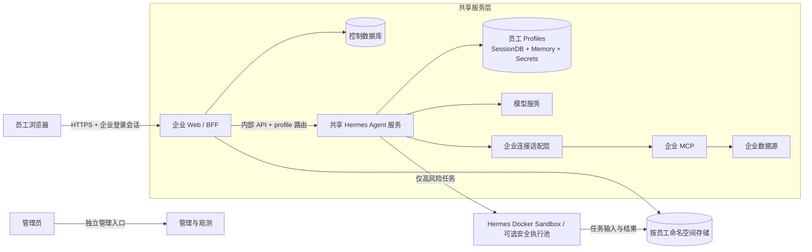

# 单企业员工 Web Agent 架构设计

## 文档状态

- 状态：`DESIGN_READY`
- 负责人：企业 Agent 项目组
- 创建日期：2026-09-19
- 最近更新：2026-09-19
- 关联文档：[Hermes 企业 Agent 适配评估与第一版方案](../hermes-enterprise-agent-assessment.md)

## 背景

产品目标是面向单一企业员工提供类似 ChatGPT、千问、豆包的 Web Agent。第一版使用一个模型服务和一个完整业务场景，保留 Hermes 的 Agent 循环、工具编排、上下文压缩、提示缓存和会话能力，通过外围适配补充企业身份、数据隔离、业务连接、审计和部署。

产品需要同时满足两个条件：

1. 员工的会话、记忆、文件和业务权限不能串用。
2. 新增员工不能对应一个长期运行的容器，否则固定资源、部署和升级成本会随用户数近似线性增长。

因此默认架构采用共享服务和按需 Sandbox：

- Web、BFF、Hermes Agent 服务和业务连接服务由所有员工共享。
- 每名员工在 Hermes 中对应一个独立 profile，用于隔离会话、记忆、配置和 profile secrets。
- BFF 根据已验证身份决定 profile 和 Agent 服务分片，浏览器不能选择。
- 共享 Hermes 进程不开放宿主机终端、任意文件访问、跨 profile 搜索等高风险能力。
- 只有代码执行、复杂文件处理、浏览器自动化等少量任务进入临时 Sandbox；第一版优先复用 Hermes 已有 Docker execution environment。
- 独立常驻 Agent 实例只作为高敏部门或更强隔离等级的可选部署方式。

Hermes profile 是状态作用域，不是完整的终端用户授权系统。企业身份和资源归属仍由 BFF 校验，业务数据权限仍由 MCP 与源系统执行；Sandbox 则约束真正的进程、文件和网络访问。

## 目标

- 提供自然对话、个人历史、流式回答、停止生成和按场景启用的附件。
- 允许范围内的工具自动执行，不向员工展示命令、任务图或技术审批。
- 每名员工拥有独立的 Hermes 会话、内置记忆和 profile secrets。
- 共享 Agent 服务不能通过模型工具读取其他员工的 profile、会话或文件。
- 高风险执行只进入按任务创建或从安全池租用的 Sandbox。
- 浏览器不持有 Hermes API key、profile 名称、Sandbox 凭据或业务 token。
- 完整记录任务效果、耗时、API 调用、token、缓存命中、费用、工具摘要和授权结果。
- 不修改 Hermes Agent 核心；企业代码通过公开 API、profile、Skill、插件或 MCP 适配。
- 第一版在一台 Linux 服务器上完成试点，并能通过 Agent 服务分片和 Sandbox 池扩容。

## 非目标

- 多企业 SaaS 租户、套餐、企业计费和跨企业运营。
- 每员工一个常驻容器或常驻 Hermes 进程。
- 把企业 user / tenant 字段加入 Hermes 核心所有表和工具。
- 重写 Agent 循环、SessionDB、上下文压缩或提示缓存。
- 将 Hermes Dashboard 改造成员工门户。
- 第一版开放通用 Shell、任意插件安装、模型切换、定时任务或业务写工具。
- 用日志代替访问控制，或用提示词代替源系统授权。
- 第一版就建设 Kubernetes、跨机自动调度和复杂 Sandbox 平台。

## 推荐架构



### 成本模型

共享 Web、BFF 和 Hermes Agent 服务构成平台固定成本。新增普通员工主要增加：

- 一个 profile 的会话、记忆和少量配置存储。
- 活跃会话的内存缓存。
- 真实发生的模型、搜索、MCP 和存储用量。
- 只有任务需要执行代码、处理文件或驱动浏览器时才产生的 Sandbox 计算量。

容量达到单个 Hermes 服务上限后，按一组员工增加 Agent 服务分片，例如每个分片承载几十或数百名员工；BFF 保存 `employee → shard + profile` 映射。扩容单位是分片，不是用户。

## 组件职责

### 员工 Web 前端

员工端是对话产品，不是 Agent 运维控制台。第一版包含：

- 左侧个人会话列表。
- 主对话区和流式回答。
- 输入框与按场景启用的附件入口。
- 回答生成期间的“停止生成”。
- “正在处理”等简单状态与用户可理解的错误。

员工端不展示工具名称、Shell 命令、任务图、审批卡片、profile、Sandbox、内部 run ID 或 token 明细。工具事件和用量事件进入后台审计与观测系统。

### 企业 BFF

BFF 是员工不可见的薄控制层：

- 完成 OIDC 登录、账号启停和 Web 会话管理。
- 使用不可变的 OIDC `issuer + sub` 映射企业员工。
- 维护 `employee → Agent shard + opaque profile` 映射。
- 校验 conversation、run、file 等资源归属。
- 隐藏 Hermes profile 路径、API key 和内部地址。
- 转发 Runs / Sessions 请求和筛选后的 SSE 回答事件。
- 管理附件命名空间、任务幂等、审计和用量摘要。

BFF 不参与 Agent 推理，不编排 Hermes 工具，也不替代源系统权限。它不把内部工具事件转换成员工审批流程。

### 共享 Hermes Agent 服务

第一版运行一个启用 multiplex 的 Gateway / API Server：

- 每名员工对应一个 named profile。
- 每个 profile 拥有独立 `HERMES_HOME`、SessionDB、内置记忆、配置和 profile secrets。
- BFF 使用 `/p/<profile>/...` 和该 profile 的独立 `API_SERVER_KEY` 调用。
- profile 名称使用内部不可猜测标识，不使用邮箱、工号等可枚举字段。
- unprefixed 默认 profile 不承载普通员工业务。
- 普通员工不能创建、删除、重命名或切换 profile。

Hermes multiplex 已提供 profile runtime scope、secret scope、独立 SessionDB 和 profile API key。它也明确说明 profile 不负责终端用户认证，因此 BFF 的身份和归属校验不能省略。[Multiplexing Gateway Internals](../../website/docs/developer-guide/multiplexing-gateway.md)、[API Server 多 profile 路由](../../website/docs/user-guide/features/api-server.md)

### 按需 Sandbox

Sandbox 只处理共享进程不应直接执行的能力：

- Python、Shell 或其他代码执行。
- PDF、Office、压缩包等复杂文件解析。
- 需要本地依赖的计算任务。
- 浏览器自动化或下载未知内容。
- 其他会产生进程、文件或网络副作用的操作。

Sandbox 的隔离单位是一次活跃会话或任务，不是一个长期用户实例。第一版优先复用 `tools/environments/docker.py`：Docker 环境在第一次调用 terminal / execute_code 时按会话创建，关闭或空闲回收；规模扩大后再评估独立安全池。每个 Sandbox 获得：

- 随机 task ID 和短期 capability token。
- 独立临时目录、CPU、内存、时长和进程数限制。
- 只读输入和受控输出位置。
- 按场景配置的网络 allowlist。
- 不包含 Hermes profile home、其他员工文件、模型 key 或长期业务凭据的环境。

会话关闭、空闲超时、取消或异常后回收 Sandbox。需要保留的输出先写入员工文件命名空间，容器或微虚机本身不作为持久存储。

第一版不新建 Sandbox 调度系统，使用现有 Docker backend 并固定以下安全姿态：`container_persistent: false`、不挂载宿主机工作目录、不配置任意 `docker_volumes`、不转发业务或模型环境变量、设置 CPU / 内存 / 磁盘 / PID 限制；默认 `docker_network: false`，确需联网时通过受控 egress allowlist。现有实现已经具备 cap-drop、no-new-privileges、tmpfs、profile / task 标签、非持久会话隔离和清理逻辑，企业适配主要是配置、文件交接和验收。

### 企业连接与 MCP

业务连接默认只读，并在 Hermes 核心之外交付。MCP 和源系统必须依据可信的服务端身份授权，不能相信模型工具参数中的 `employee_id`、部门、profile 或 token。

当前 Hermes multiplex 有一个必须正视的限制：MCP discovery 和 tool registration 仍有进程级状态，不能直接假设每个 profile 都能安全加载不同 MCP 配置和员工 token。该限制记录在项目的 [multiplex 已知限制](../../website/docs/developer-guide/multiplexing-gateway.md#known-limitations) 中。第一版采用以下两种安全模式之一：

1. **共同只读权限**：首个场景访问所有试点员工都获准读取的企业数据，Hermes 使用统一的最小只读服务凭据。
2. **员工级权限适配**：使用企业私有的边缘插件 / 连接适配器，从当前 profile 的服务端 scope 获取短期凭据，再调用企业 MCP；必须用 A → B → A 集成测试证明 token 和结果不串用。

如果首个场景要求员工级源系统 ACL，则第二种模式是上线前置条件。不得把 access token 放进工具参数、提示词、URL 或模型可读取的文件。

企业 MCP 作为 OAuth 受保护资源服务器时应验证 `iss`、`aud` / resource、`exp`、必要的 `nbf`、`sub` 和 scope。MCP token 与下游系统 audience 不同的，应使用 OBO / token exchange 获取源系统 token；不能原样转发。源系统最终再次授权。

## 为什么共享 profile 方案可行，以及它的边界

### 共享的内容

- Hermes 进程、事件循环和 HTTP 监听器。
- 模型客户端与公共 provider 配置。
- 经过审核的公共 Skill 版本。
- 只读企业连接服务。
- 观测、限流和 Sandbox 调度基础设施。

### 按员工隔离的内容

- BFF 身份与资源归属。
- Hermes profile、SessionDB、内置记忆和 profile secrets。
- conversation / run 映射。
- 附件和结果文件命名空间。
- MCP 员工 token 或 profile-scoped connector credential。
- 用量、预算和审计主体。

### 不允许留在共享 Hermes 进程中的能力

- `session_search` 的跨 profile 查询能力。
- 指向宿主机的通用文件浏览。
- 宿主机终端和未固定到受限 Docker backend 的代码执行。
- 携带长期业务凭据的子进程。
- 未验证为 profile-safe 的第三方插件或 MCP 配置。

profile 隔离用于防止正常产品路径串数据，不构成对 Hermes 进程本身、恶意插件或宿主机权限突破的安全边界。高敏用户、监管数据或需要对抗性隔离的场景，应路由到独立 Agent 服务分片甚至独立实例；这是一种隔离等级，不是所有用户的默认成本。

## 关键业务流程

### 登录和路由

1. 员工通过企业 OIDC 登录；BFF 校验签名、issuer、audience、有效期和必要 claims。
2. BFF 使用 `issuer + sub` 查找员工，不以邮箱作为授权主键。
3. 未开通或已停用的员工被拒绝。
4. BFF 加载固定的 `shard_id`、`profile_name` 和 profile key secret reference。
5. 浏览器只获得企业 Web 会话，不接触 Hermes 地址、profile 或 key。

### 创建会话

1. BFF 创建带员工归属的 conversation 记录。
2. BFF 调用目标 Hermes shard 的 `/p/<profile>/api/sessions`。
3. 成功后保存 Hermes session ID；浏览器只看到企业 conversation ID。
4. Hermes profile 名称和 session ID 均不能由浏览器用于选择其他作用域。

### 提交任务与流式回答

1. 浏览器生成 `client_request_id` 并向 BFF 提交消息。
2. BFF 校验 conversation 归属，并阻止同一会话的并发写入。
3. BFF 使用稳定、不可猜测的 `Idempotency-Key` 调用 profile-scoped Runs API。
4. BFF 保存 Hermes run ID，订阅并筛选 SSE 事件。
5. 前端只收到文本增量、简单状态、最终结果和用户可理解错误。
6. BFF 在后台记录工具摘要、授权结果、耗时、token、缓存和成本。
7. 页面断线后重新连接原企业 run，不创建新任务。

### 高风险工具调用

1. Hermes 调用经过审核的 Sandbox 工具接口。
2. 适配器从当前可信 profile scope 推导员工与任务上下文，不接受模型覆盖主体。
3. Sandbox 服务校验短期 capability token、任务范围和资源限额。
4. Sandbox 只获取该任务需要的输入，不挂载完整 Hermes home。
5. 结果经大小、类型和敏感信息检查后返回 Hermes；需要持久化的文件写入员工命名空间。
6. Sandbox 清理或归还安全池，任务 token 立即失效。

### 停止生成与自动执行

- BFF 只允许当前员工停止本人活动 run。
- Agent 服务使用 `approvals.mode: off`，已启用的只读工具和 Sandbox 调用自动执行。
- Hermes hardline blocklist 和显式 `approvals.deny` 仍先于 `off` 生效。
- 策略、网络或源系统拒绝直接形成失败和审计，不转成员工审批弹窗。
- 第一版不提供员工 approval API，也不注册业务写工具。

## 权威数据边界

| 数据 | 权威来源 | 企业层保存内容 |
| --- | --- | --- |
| 员工身份和状态 | 企业 IdP / BFF | `issuer + sub`、状态、角色 |
| 员工路由 | BFF 控制库 | shard、opaque profile、secret reference |
| 对话消息 | 员工 profile 的 SessionDB | conversation 与 Hermes session 映射 |
| 个人长期记忆 | 员工 profile 的 memory | 不复制正文到控制库 |
| Agent run 状态 | Hermes Runs API | 企业 run 映射、终态和用量摘要 |
| 员工文件 | 受控对象存储或命名空间 | 归属、存储键、哈希、大小、状态 |
| Sandbox 临时数据 | Sandbox 服务 | 仅任务生命周期内存在 |
| 业务权限 | MCP / 源系统 | 授权结果和脱敏对象摘要 |
| token 与成本 | Hermes 用量和供应商账单 | 任务级快照、币种、actual / estimated / unknown |

控制库不复制完整对话，不成为第二份会话权威来源。

## 企业层数据结构

### `employees`

| 字段 | 说明 |
| --- | --- |
| `id` | 企业内部员工 ID |
| `oidc_issuer`、`oidc_subject` | 稳定登录身份，联合唯一 |
| `status` | `active` / `disabled` |
| `role` | `employee` / `admin` |
| `agent_shard_id` | 目标共享 Hermes 服务分片 |
| `profile_name` | 内部 opaque profile 标识 |
| `profile_secret_ref` | profile API key 引用，不存明文 |

### `conversations`

| 字段 | 说明 |
| --- | --- |
| `id` | 浏览器可见的随机 conversation ID |
| `employee_id` | 所属员工，所有查询必须绑定 |
| `hermes_session_id` | profile 内部 session ID |
| `title` | 展示标题 |
| `status` | `creating` / `active` / `deleted` / `error` |

### `runs`

| 字段 | 说明 |
| --- | --- |
| `id` | 企业 run ID |
| `employee_id`、`conversation_id` | 冗余归属，查询时一起校验 |
| `client_request_id` | 浏览器重试标识，员工范围内唯一 |
| `hermes_run_id` | Hermes run ID |
| `idempotency_key` | 调用 Hermes 的全局唯一键 |
| `status`、`started_at`、`ended_at` | 生命周期 |
| `usage_json` | 原始用量摘要及 schema / source 版本 |
| `cost_amount`、`currency`、`cost_status` | 成本与口径 |
| `error_code`、`trace_id` | 脱敏错误和链路追踪 |

### `files` 与 `audit_events`

文件记录必须包含 employee、storage key、原始名、检测类型、大小、哈希和状态。审计记录必须包含 actor、action、resource、result、trace ID、时间和大小受限的脱敏 metadata；不记录凭据、完整问题、完整工具输出或命令全文。

## 企业 Web API

| 方法 | 路径 | 用途 |
| --- | --- | --- |
| `GET` | `/api/me` | 当前员工和功能开关 |
| `GET/POST` | `/api/conversations` | 本人会话列表与创建 |
| `GET/PATCH/DELETE` | `/api/conversations/{id}` | 本人会话读取、重命名和删除 |
| `GET` | `/api/conversations/{id}/messages` | 本人历史 |
| `POST` | `/api/conversations/{id}/runs` | 提交任务 |
| `GET` | `/api/runs/{id}` | 查询本人 run |
| `GET` | `/api/runs/{id}/events` | SSE 回答与重连 |
| `POST` | `/api/runs/{id}/stop` | 停止本人活动 run |
| `POST/GET` | `/api/files`、`/api/files/{id}` | 场景需要时上传与下载本人文件 |

所有资源查询绑定当前登录 employee。他人资源和不存在资源均返回 404。客户端不能提交 employee、profile、Agent endpoint、Hermes session ID、服务器路径或 Sandbox 地址。

## Hermes 复用与配置

### 直接复用

- `run_agent.py`、`agent/`：Agent 循环、压缩、缓存、用量和生命周期。
- `hermes_state*`：SessionDB、消息、token、API 次数和成本。
- API Server：Sessions、Runs、SSE、停止、幂等和 `/p/<profile>/` 路由。
- multiplex runtime scope：profile home、secret scope、会话、记忆和缓存的作用域。
- Skills / plugins：企业场景指导和边缘适配。

### 配置要求

- `gateway.multiplex_profiles: true`。
- 只允许明确开通的员工 profiles；默认 profile 不承载员工会话。
- 每个 profile 使用不同 `API_SERVER_KEY`。
- 一个企业固定模型和稳定 toolset；配置变化默认从新会话生效。
- `approvals.mode: off`，同时保留 hardline 和显式 deny。
- 共享进程关闭跨 profile session search、任意路径文件工具和未经验证的插件。
- terminal / execute_code 如启用，必须固定到非持久、无宿主机挂载的 Docker backend；禁止 local backend。

### 当前限制

- profile 隔离状态，但不认证最终员工；BFF 必须处理身份和归属。
- multiplex 共享进程和 OS 账号，不对抗进程内恶意代码。
- MCP discovery / tool registration 仍有进程级状态；员工级 token 需专门适配并验证。
- Terminal / Sandbox 的部分环境配置为进程级，不能在共享进程里按员工直接切换。
- API Server 不提供通用 OpenAI `file_id` / `input_file` 上传；附件需企业层适配。

这些限制正是将终端、文件处理和个性化 MCP 凭据移到边缘适配器或 Sandbox 的原因，不要求重写 Agent 核心。

## 方案比较

### 方案 A：所有员工共享一个 profile

- 固定成本最低。
- 会话可以分 ID，但内置记忆、profile secrets 和状态无法按员工可靠隔离。
- 不采用。

### 方案 B：共享 Hermes multiplex，每员工一个 profile，按需 Sandbox

- Agent 服务、模型连接和公共能力共享。
- 员工状态按 profile 隔离，高风险执行按任务隔离。
- 新增员工没有常驻容器成本，能够按分片水平扩展。
- 需要严格缩小共享 toolset，并验证 profile scope 和 MCP 身份传播。
- 作为默认方案。

### 方案 C：每员工独立常驻 Hermes 实例

- 进程、文件挂载和故障影响面最清晰。
- 固定计算、连接、升级和观测成本随用户数增长。
- 适合监管、高敏或需要对抗性隔离的用户组，不作为普通员工默认方案。

| 维度 | 共享 profile | multiplex + 按需 Sandbox | 独立常驻实例 |
| --- | --- | --- | --- |
| 新增用户固定成本 | 最低 | 低 | 高 |
| 会话和记忆隔离 | 不足 | profile 隔离 | 实例隔离 |
| 高风险执行隔离 | 无 | 按任务隔离 | 实例内仍需 Sandbox |
| 故障影响面 | 整体 | Agent 分片 / Sandbox 任务 | 单用户 |
| 扩容单位 | 整体 | 用户分片和 Sandbox 池 | 用户实例 |
| 核心改动 | 无 | 无，边缘适配 | 无 |
| 默认适用性 | 不采用 | 普通企业员工 | 高敏隔离等级 |

## 拟议目录

```text
enterprise/
├── backend/                    # OIDC、授权、路由、SSE、控制库
│   ├── auth/
│   ├── routing/                # employee → shard + profile
│   ├── conversations/
│   ├── files/
│   ├── audit/
│   └── data/
├── frontend/                   # 员工聊天 Web
├── connector/                  # 企业 MCP / profile credential 适配
├── sandbox/                    # Docker backend 配置、镜像、文件交接和资源策略
├── deploy/                     # BFF、共享 Hermes、连接服务和 Sandbox 池
└── scenarios/
    └── <first-scenario>/       # Skill、测试集和业务连接配置
```

不修改 `run_agent.py`、`agent/turn_*`、`hermes_state*`、内置 memory schema 或核心工具协议。若公开 API 确实缺少通用能力，先以真实调用链证明缺口，再单独设计上游兼容改动。

## 缓存、记忆与会话

隔离采用两个相互独立的维度：**一个员工对应一个 profile，一个对话对应一个 Hermes session**。不能只创建不同 session 而让多名员工共用 profile，也不需要为同一员工的每个对话创建 profile。

```text
员工 A profile
├── MEMORY.md / USER.md          # A 的个人长期记忆
├── SessionDB
│   ├── session A1               # 对话 A1 的消息与短期上下文
│   └── session A2               # 对话 A2 的消息与短期上下文
└── profile secrets

员工 B profile
├── MEMORY.md / USER.md          # B 的个人长期记忆
├── SessionDB
│   └── session B1               # 对话 B1 的消息与短期上下文
└── profile secrets
```

| 状态 | 隔离边界 | 预期行为 |
| --- | --- | --- |
| 对话消息、工具结果和压缩上下文 | Hermes session | A1 与 A2 互相看不到聊天记录，即使属于同一员工 |
| 运行中的 Agent 缓存 | profile 命名空间 + session key | 不同员工、不同对话不能复用同一个运行态 Agent |
| `MEMORY.md`、`USER.md` | 员工 profile | A 的多个对话可使用 A 的个人长期记忆，B 永远不能读取 |
| 企业知识 | MCP / 源系统授权 | 查询时按员工权限获取，不写入所有人的个人记忆 |
| 附件和任务结果 | 员工命名空间 + conversation / task | 只向归属员工和对应任务开放 |

Hermes 会把内置记忆作为会话开始时的冻结快照放入系统提示。会话内发生的记忆写入可以持久化，但不能修改该会话已经缓存的提示前缀；之后创建的新会话才读取最新记忆。这是预期的缓存语义，不应由 BFF 每轮强制刷新。

第一版默认采用类似消费级聊天产品的语义：同一员工的不同对话不共享消息历史，但共享该员工的个人长期记忆。如果未来提供“临时对话”，应在创建对话时固定为不读取、不写入个人长期记忆，并在整个会话生命周期保持不变，不能中途切换而破坏缓存。

- 一个 Web conversation 始终映射到同一个员工 profile 和一个独立 Hermes session。
- 页面刷新、SSE 重连或 BFF 重启不得新建会话或重建历史前缀。
- profile toolset、系统提示和公共 Skill 在活动会话内保持稳定。
- 配置变化默认从新会话生效，避免破坏提示缓存。
- 内置记忆只写入当前 profile；A → B → A 测试必须证明写入位置正确。
- Sandbox 不保存 Agent 长期记忆，只接收任务级输入并返回结果。
- 公共企业知识通过授权连接查询，不复制到所有员工 `MEMORY.md`。

## 安全边界

### 入口与授权

- 只公开 HTTPS BFF；Hermes、控制库、MCP 和 Sandbox 控制面位于内部网络。
- BFF 从登录会话读取 employee，不接受客户端声明员工身份。
- profile 路由和 key 只在服务端解析。
- conversation、run 和 file 查询必须同时绑定 employee。
- Dashboard 与员工入口使用不同域名、凭据和网络策略。

### 共享 Hermes 进程

- 最小 toolset，不开放能遍历宿主机或其他 profile 的工具；执行工具只能落到受限 Docker backend。
- 未经 profile-safety 验证的插件不得安装。
- profile scope 缺失必须失败，不回退默认 profile secrets。
- 每个 profile 独立 API key，跨 profile run ID 返回 404。
- 公共 Skill 只读发布，员工不能修改全局配置。

### Sandbox

- 非 root、只读根文件系统、独立临时目录和资源配额。
- 不挂载 Docker socket、Hermes homes、宿主机 home 或其他任务目录。
- capability token 短期、单任务、最小权限且不可重放。
- 网络默认拒绝，只开放任务必需的目标。
- 子进程环境不含模型 key、OIDC token 或长期业务 token。
- 回收前清理工作目录和进程；安全池实例必须恢复已验证的干净快照。

### MCP 与凭据

- OIDC ID token 不直接发送给 MCP 或源系统。
- MCP access token 只发送给对应 audience。
- 员工级 token 从可信 profile context 获取，不由模型填写。
- 源系统再次执行 ACL；服务账号不能自动赋予所有员工全部权限。
- 日志、错误、工具 preview 和 Sandbox 输出均执行凭据脱敏。

## 可观测性与成本

统一 trace ID 串联浏览器请求、BFF run、Hermes run、MCP 调用和 Sandbox job。后台结构化记录：

- 员工、conversation、run、profile shard 和时间。
- 模型版本、API 请求数、input / output / cache read / cache write / reasoning token。
- 工具名称、耗时、结果状态和脱敏对象摘要。
- MCP 授权结果与源系统错误分类。
- Sandbox 排队、启动、CPU / 内存、时长、退出状态和回收结果。
- actual / estimated / included / unknown 成本及币种和来源。

默认不记录员工问题全文、附件正文、完整工具输出、命令全文或任何凭据。管理员默认查看运行元数据和聚合用量，查看员工内容需要单独的企业授权流程。

主要指标包括：

- 首次输出时间、总耗时、成功率、停止率和 429。
- 每活跃用户和每任务的模型、搜索、Sandbox 与存储成本。
- Agent 服务并发、内存、profile cache 数和分片容量。
- Sandbox 冷启动、复用率、排队时间和失败清理次数。
- 权限拒绝、策略阻断和跨用户访问测试结果。

## 部署与扩容

### 第一版

- 一套员工 Web / BFF。
- 一个共享 Hermes multiplex Agent 服务。
- 2～5 个员工 profiles，人工开通。
- 一个控制数据库；试点可使用 SQLite WAL。
- 一个企业只读连接服务。
- 业务需要时启用 Hermes 内置 Docker Sandbox；暂不建设独立调度池。
- 一个模型服务，当前候选为 DeepSeek。

### 扩容顺序

1. 先测量 Agent 服务的并发、内存、SessionDB I/O 和模型限流。
2. 达到阈值后增加 Hermes shard，按员工稳定分配，避免每次请求漂移。
3. Sandbox 按任务队列与并发独立扩容，不与 Agent shard 绑定。
4. 控制库在需要多个 BFF 实例时迁移到 PostgreSQL。
5. 只有高敏用户才迁移到独立 Agent 实例或更强隔离运行池。

profile 迁移需要停止该员工的新 run、备份 profile home、复制并校验、更新 BFF 路由，再恢复服务。活动会话不能在两个 shard 同时写入。

## 风险与控制

| 风险 | 影响 | 控制与验证 |
| --- | --- | --- |
| BFF 归属校验遗漏 | 跨员工访问 | 查询绑定 employee；篡改 ID E2E |
| profile scope 泄漏 | 记忆、secret 或 SessionDB 串用 | A → B → A 真路径测试；缺 scope 失败关闭 |
| 共享工具读取其他 profile | 严重数据泄漏 | 关闭跨 profile search 和任意文件；terminal 强制 Docker 且无宿主挂载 |
| MCP registry 进程级共享 | 员工 token 串用 | 共同只读权限或 profile-aware adapter；A → B → A token 测试 |
| Sandbox 逃逸或残留 | 数据或凭据泄漏 | 最小挂载、网络拒绝、短期 token、清理与逃逸测试 |
| 单 Agent shard 故障 | 一组员工暂时不可用 | 健康检查、重启、分片容量和恢复演练 |
| BFF 重试重复 run | 重复成本或副作用 | 本地唯一键 + Hermes Idempotency-Key |
| 配置更新破坏缓存 | 成本上升 | 新会话生效；缓存用量回归 |
| 固定服务成本过高 | 用户单位经济性差 | 记录每活跃用户成本；Sandbox 按需与池化 |
| 未来写操作重复 | 业务损失 | 第一版不注册；后续独立授权、幂等和结果核验设计 |

## 验收标准

### 产品体验

- [ ] 员工端只有自然聊天、历史、附件（如启用）、简单状态和停止生成。
- [ ] 正常允许的工具调用无需员工确认即可完成。
- [ ] 员工端不出现 profile、命令、工具任务图或审批卡片。

### 身份与状态隔离

- [ ] 员工 A、B 使用同一 Hermes 服务，A → B → A 后只看到各自会话和记忆。
- [ ] 同一员工的 A1、A2 两个对话不能互相读取消息和短期上下文，但新会话能按策略读取该员工最新的长期记忆。
- [ ] A1 写入个人记忆后不改变 A1 已冻结的提示前缀；新建 A3 后可以读取该记忆，员工 B 的任何会话均不可读取。
- [ ] 每个员工使用不同 profile key，跨 profile key 和 run ID 均被拒绝。
- [ ] 篡改 conversation、run、file 或 profile 标识不能访问他人资源。
- [ ] 共享 toolset 不包含跨 profile session search 或任意路径读取；terminal / execute_code 只能使用受限 Docker backend。
- [ ] 停用员工后，新登录和新任务立即被拒绝。

### Sandbox

- [ ] 普通纯对话和只读 MCP 任务不启动 Sandbox。
- [ ] 代码或文件处理任务只获得该任务输入和短期 token。
- [ ] Sandbox 不能读取 Hermes homes、其他任务目录或长期凭据。
- [ ] 完成、超时、停止和异常退出后均能清理，必要输出仍归属正确。

### MCP 与业务权限

- [ ] MCP 验证 token issuer、audience、期限、subject 和 scope。
- [ ] 员工身份来自可信服务端上下文，不来自模型参数。
- [ ] A → B → A 测试证明 token、查询条件和结果不会跨员工复用。
- [ ] 第一版不存在业务写工具。

### 会话、缓存与成本

- [ ] 页面刷新和 SSE 断线重连原 run，不重复创建任务。
- [ ] 同一 conversation 并发写入被明确拒绝或排队，不破坏消息顺序。
- [ ] 连续会话保持同一 Hermes session 和稳定提示前缀。
- [ ] 每任务记录 token 细分、API 次数、缓存、模型成本和 Sandbox 成本。
- [ ] 容量测试能给出共享 Agent 服务每活跃用户成本和 Sandbox 使用比例。

### 恢复与扩容

- [ ] 服务器重启后 BFF、控制库、Hermes profiles 和历史恢复正确。
- [ ] 单个 Sandbox 失败不影响其他任务和 Agent 主服务。
- [ ] profile 备份恢复保持 SessionDB、记忆和归属一致。
- [ ] 增加第二个 Agent shard 后，员工路由稳定且会话不会双写。

## 待决策项

- 首个完整业务场景及其输入、输出、数据源和验收标准。
- 首个 MCP 场景是所有员工共同只读权限，还是必须执行员工级 ACL。
- 是否需要附件、代码执行、复杂文档解析或浏览器自动化，从而决定 Sandbox 范围。
- 试点并发、单任务 token / 费用预算和超限行为。
- 对话、记忆、文件、审计和用量保留周期。
- 企业数据能否发送到当前模型 API，以及脱敏要求。
- 哪些部门需要高于默认 profile + Sandbox 的独立 Agent 隔离等级。

这些决策影响适配范围和部署配置，不要求把 Hermes Agent 核心改造成多租户系统。
