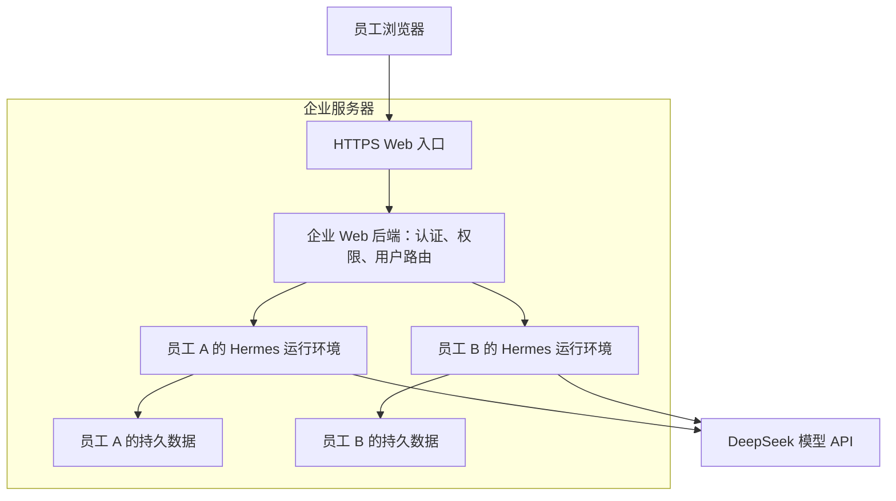

# Hermes 企业 Agent 适配评估与第一版方案

更新日期：2026-09-17  
文档性质：讨论汇总、技术评估与试点建议。用于确定方向，不代表相关企业功能已经实现或通过生产验收。

## 1. 结论与当前范围

Hermes 值得作为企业 Agent 的核心候选。它已经具备真实的多步骤任务执行、工具调用、上下文管理、记忆、Skills 和多种交互入口，可以通过外围适配形成企业产品。

当前方向是：**服务单一企业，第一版采用 Web 入口，保留 Hermes 核心，通过身份隔离、业务连接和部署适配实现员工个人助手。**

这条路线符合项目强调的“核心保持精简、能力在边缘扩展”原则，也符合用户看中现有 Agent 能力和成本表现、希望减少核心研发的目标。[项目开发约定](../AGENTS.md)

| 项目 | 当前共识或建议 |
|---|---|
| 服务范围 | 单一企业；此前多家企业的设想已收敛 |
| 核心定位 | 复用 Hermes，不自行重写 Agent 循环、上下文压缩和缓存机制 |
| 企业入口 | 第一版优先 Web |
| 模型服务 | 第一版只接一个服务；已有实测使用 DeepSeek V4 Pro |
| 业务范围 | 一个完整业务场景，具体场景尚待确定 |
| 用户形态 | 员工个人助手，对话、记忆和文件按员工隔离 |
| 试点规模 | 建议先人工开通 2～5 名员工；这是试点建议，尚未确定容量目标 |

单企业仍然需要员工隔离和业务权限，但暂时不引入跨企业租户管理、企业自助入驻与跨企业计费等产品范围。

## 2. Hermes 核心能力的评估

应将“核心能否执行任务”“模型回答是否正确”和“企业产品是否具备完整权限”分开评估。一个回答中的推断错误，不直接证明 Agent 循环有缺陷；工具执行完成，也不等于业务结果正确。

| 维度 | 当前依据与判断 | 企业应用需要继续验证的内容 |
|---|---|---|
| 多步骤执行 | 实测完成检索、下载 PDF、编写并运行脚本、定位数据、计算和整理回答 | 在目标业务中能否稳定完成任务，失败后能否给出可处理的结果 |
| 工具能力 | 终端、文件、网页、浏览器、Skills 等能参与真实执行 | 工具访问是否限制在员工获准的数据和系统范围内 |
| 成本机制 | 项目重视稳定提示前缀和缓存；实测输入缓存命中率约 92% | 不同任务、长会话、重启和模型服务变化后的成本分布 |
| 上下文与记忆 | 有会话存储、上下文压缩及内置或外部记忆机制 | 长任务压缩后的信息保留、员工记忆归属、重启后的正确恢复 |
| 可扩展性 | 支持 Skills、插件、MCP 和已有程序接口 | 企业连接是否可以保持独立、兼容后续上游升级 |
| 运行控制 | 源码中有重试、取消、会话租约、存活监测、迭代预算及用量统计机制 | 这些机制在实际部署和并发条件下的行为，不能仅凭机制存在判断 SLA |
| 结果可信度 | 实测财务提取与计算表现较好，部分推断超出证据 | 引用是否支持结论，事实与推断是否明确区分 |
| 企业适配 | 可以复用核心实现内部研究、文档分析及业务辅助 | 企业账号、授权、审计、运行隔离和业务操作保护仍需适配 |

因此，当前判断是“适合作为核心候选并进入受控试点”。单次股票分析尚不能证明高并发、生产高可用、任意步骤的持久恢复，或外部业务操作恰好执行一次。

研究、检索和分析类任务较适合先试点。涉及修改业务记录、审批、付款等操作时，业务 API 必须独立执行授权、校验和必要的幂等保护，不能依赖模型自行遵守提示词。

核心机制可结合 [Agent Loop](https://hermes-agent.nousresearch.com/docs/developer-guide/agent-loop)、[上下文压缩与缓存](https://hermes-agent.nousresearch.com/docs/developer-guide/context-compression-and-caching) 和 [会话存储](https://hermes-agent.nousresearch.com/docs/developer-guide/session-storage) 文档继续核对。

## 3. 已有实测：贵州茅台年报分析

### 3.1 测试内容与用量

任务要求以贵州茅台 2025 年年度报告和其中的 2024 年对比数据为依据，在假设股价 1,500 元、持有期限三年的条件下，提取财务数据、计算估值与现金流指标，并给出附条件的判断。该样本用于评估 Agent 执行、证据和成本，不用于确认投资结论。

| 指标 | 用户提供的数据 |
|---|---:|
| 模型 | DeepSeek V4 Pro |
| 模型 API 请求次数 | 21 |
| 输入 token：命中缓存 | 596,224 |
| 输入 token：未命中缓存 | 51,610 |
| 输入 token 合计 | 647,834 |
| 输出 token | 15,758 |
| 全任务 token 合计 | 663,592 |
| 页面显示费用 | ¥1.06 CNY |

输入缓存命中率的口径为：

```text
596,224 ÷ (596,224 + 51,610) ≈ 92.03%
```

663,592 是整个任务各次模型请求的累计用量，同一段历史上下文可能被多次计入输入，并不表示一次请求包含这么长的上下文。15,758 也是累计输出，不能与最后一段回答的篇幅直接比较。

### 3.2 费用复核与解读

按 DeepSeek V4 Pro 高峰时段每百万 token 的缓存输入 ¥0.30、未缓存输入 ¥9.00、输出 ¥27.00 复算如下。费率于文档整理日期核对，后续预算应再次核对实际模型版本、请求时段和账单。[DeepSeek 官方价格页](https://api-docs.deepseek.com/zh-cn/quick_start/pricing/)

| 部分 | 计算 | 费用 |
|---|---|---:|
| 缓存输入 | 596,224 / 1,000,000 × 0.30 | ¥0.1788672 |
| 未缓存输入 | 51,610 / 1,000,000 × 9.00 | ¥0.4644900 |
| 输出 | 15,758 / 1,000,000 × 27.00 | ¥0.4254660 |
| 合计 | 三项相加 | ¥1.0688232 |

复算值约 ¥1.07，与页面显示的 ¥1.06 基本接近；精确差异需要逐请求账单、时段和显示精度才能解释。

同一组用量若全部按空闲时段半价计费，理论费用约为 ¥0.5344；这是按费率换算的情景，不是另一次实测。

若假设同样的输入全部未命中缓存，其他用量不变，理论费用约 ¥6.2560。实际 token 组合的理论费用比这一假设低约 82.9%。这说明本次任务显著受益于模型服务的缓存计费，**不能据此认定 Hermes 比其他 Agent 节省 82.9%**。

当前实测费用只反映用户页面给出的模型调用费用。企业总成本还需要计入搜索、浏览器等工具服务，以及服务器、存储和运维。

### 3.3 工具与脚本执行

用户展示的工具记录分组合计约 20 次调用，但页面信息可能不完整；工具调用次数、模型 API 请求次数，以及一次搜索工具内部的搜索次数，是不同的统计口径。

本次展示的执行路径包括：

1. 加载股票分析和引用相关 Skills。
2. 检索报告与财务指标，提取网页。
3. 尝试下载 PDF，检查本地 Python 和 PDF 工具。
4. 安装 `pypdf`，编写下载及提取脚本。
5. 扫描 PDF 页面的关键词，读取目标页。
6. 使用代码进行精确计算，整理结论。

安装 `pypdf` 的工具记录耗时约 65.5 秒，但未提供整个任务的总耗时，不能将其当作全任务耗时。

脚本处理 PDF 的字节数与运行时间不会直接变成模型 token；生成脚本、返回给模型的工具文本，以及后续请求携带的上下文会计入模型用量。页面最后显示的 Thinking / Total 小计也不能替代全任务统计。

这一样本显示了 Hermes 的实际执行能力，也暴露了可在外围改善的成本与耗时来源：预装 PDF 依赖、准备可靠的文档提取脚本、限定工具返回范围、复用下载结果，并为目标业务提供清晰的 Skill。

### 3.4 回答质量与边界

此前对回答的抽查判断是：主要财务数据和计算结果基本正确，来源及页码便于复核，最终结论带有成立条件；但以下表述需要更严格的证据约束：

- 年报将经营现金流下降主要归因于财务公司资金项目，不能直接推出“白酒主业回款没有恶化”。
- “历史估值偏低”“安全边际优于历史均值”需要历史估值证据，超出了仅依据该年报的任务范围。
- 年度累计分红金额应区分已经实施的分红与待批准或实施的年度方案。
- 提供的 PDF 地址为新浪镜像，应与公司或交易所正式披露版本核对，不能把镜像地址直接当作官方原始链接。

这些问题支持加强业务 Skill、引用核验和验收标准，尚不足以支持重写 Agent 核心。

## 4. 企业适配开发的边界

保留 Hermes 的任务循环、工具编排、上下文压缩、提示缓存和已有记忆接口。新增工作主要放在 Web 应用、部署配置、业务 API、Skills、独立插件或 MCP 服务中。

| 适配层 | 主要职责 |
|---|---|
| 员工 Web 应用 | 聊天、历史、进度、审批、按业务需要上传和下载文件 |
| 企业 Web 后端 | 登录、员工与运行环境的映射、会话和文件归属校验、任务记录 |
| 业务连接 | 带员工权限调用知识库或业务系统，处理结构化结果 |
| Skills / 插件 / MCP | 业务流程、工具连接、可复用文档处理能力 |
| 部署层 | 运行隔离、数据持久化、依赖预装、资源限制和日志 |

业务权限应由后端和被调用系统共同执行。模型发送的员工 ID、文件路径或 profile 名称不能直接作为授权依据。

保持原有会话与提示前缀稳定，避免外围应用每轮重建系统提示、改写已有消息或反复切换工具集合。配置和记忆更新遵循 Hermes 的缓存约定。[项目缓存约定](../AGENTS.md)

## 5. 多用户隔离：单企业也必须处理

### 5.1 会话隔离、记忆隔离与访问权限不同

Hermes 可以按不同来源建立会话；但内置 `MEMORY.md` 和 `USER.md` 存储在当前 Hermes home 的 `memories` 目录下，作用域是 profile，而不是每个员工或每个聊天。多个员工共用同一 profile 时，仅拆分会话 ID 不能保证内置个人记忆隔离。[内置记忆路径实现](../tools/memory_tool.py)

HTTP API 支持稳定的 `X-Hermes-Session-Key`，可供 Honcho 等外部记忆提供者派生作用域。这是已有的可复用能力，但不代表内置记忆、文件和员工权限都自动按该标识隔离。[记忆作用域与 API 文档](https://hermes-agent.nousresearch.com/docs/user-guide/features/api-server#long-term-memory-scoping-x-hermes-session-key)

profile 能分开配置、记忆、会话、Skills 等状态，但不能单独作为企业员工的安全边界。例如，`session_search` 支持显式打开另一个 profile 的会话数据库；进程若具备该数据库的文件访问权限，就可能访问其他 profile 的数据。[跨 profile 查询实现](../tools/session_search_tool.py)

### 5.2 第一版的隔离建议

采用“登录员工 → 个人运行环境 → 个人数据”的映射。Web 后端根据认证结果选择目标环境，员工不能通过修改请求中的 profile、session ID 或文件路径访问其他人的数据。

| 数据或能力 | 第一版边界 |
|---|---|
| 对话、历史和任务记录 | 按员工归属；每次读取和控制任务都检查归属 |
| 内置记忆 | 使用员工自己的 Hermes home / profile |
| 工作文件与工具执行 | 运行身份只能访问该员工获准的目录和资源 |
| 学习产生的 Skills、定时任务 | 归属于员工；不自动变为企业公共内容 |
| 企业公共 Skills | 由管理员发布公共基础版本，个人学习结果保存在个人范围 |
| 企业知识和业务系统 | 按源系统权限检索和操作；公共存储不等于所有员工有权读取 |
| 模型及工具凭据 | 由服务端管理，员工浏览器不持有 Hermes 管理密钥 |

建议先使用少量独立的员工运行环境。独立进程配合不同系统身份及文件权限，或限制挂载范围和运行权限的容器，都可以作为候选。只有不同进程或不同目录、但所有进程都能读取所有员工文件，仍不构成充分隔离。

只把终端工具放入容器，也不能保证 Hermes 后端自己的记忆、会话和文件读取被隔离；应覆盖整个运行环境的访问权限。

Hermes 已有共享进程的多 profile multiplex 能力，可降低运行管理开销。第一版暂不以共享进程承载私有员工环境为默认建议，后续可在明确威胁边界并完成隔离验证后评估。[多 profile 运行文档](https://hermes-agent.nousresearch.com/docs/user-guide/multi-profile-gateways)

## 6. 为什么第一版选择 Web

Web 适合当前试点：员工通过浏览器访问，长回答、任务进度、文件和审批可集中展示；集中发布也方便持续调整业务流程与评估指标。

但应区分管理员界面和员工入口。Hermes 自带 Dashboard 是机器级管理界面，可以编辑配置、管理密钥和切换多个 profile。它已有认证能力，但登录成功不等于只可访问本人数据。[Dashboard 官方文档](https://hermes-agent.nousresearch.com/docs/user-guide/features/web-dashboard)

建议保留 Dashboard 供管理员使用，员工入口使用独立的轻量 Web 应用，通过已有接口连接 Hermes。原仓库 Dashboard 的 Chat 页面嵌入真实 TUI；项目约定不在该管理界面内重新实现主聊天体验。独立员工客户端可以使用项目已经支持的集成接口。[Web 开发约定](../web/AGENTS.md)

第一版员工界面关注登录、个人历史、输入与流式回答、执行进度、停止任务和必要审批。文件上传与结果下载是否需要，取决于所选业务场景。

Web 本身不是节省 token 的主要因素；模型、上下文、缓存命中和工具返回内容才直接决定用量。外围应用应延续已有会话，避免无意破坏缓存行为。

## 7. 部署形态与接口选择

### 7.1 可以作为服务器上的常驻后端

Hermes 可以运行在服务器上，通过 HTTP 或 WebSocket 为 Web 客户端提供 Agent 能力。它是有状态的任务执行服务：除了处理请求，还会执行较长任务，并保存会话、记忆与文件。



这是逻辑示意，不代表必须为每位员工购买独立服务器。同一台服务器可以承载多个受限运行环境；企业 Web 后端只需要一个公共入口，Hermes 后端接口留在受控网络内。

继续使用 DeepSeek API 时，无需在企业服务器部署模型。此前下载 PDF、安装依赖和运行 Python 的操作，部署后会发生在服务器的员工运行环境中，Web 页面展示进度和结果。

### 7.2 可复用的服务接口

| 入口 | 形式与启动关系 | 适配方向 |
|---|---|---|
| API Server | HTTP + SSE；启用后随 `hermes gateway` 启动 | Web 后端提交任务、读取事件、审批、中止及会话连续性 |
| `hermes serve` 后端 | JSON-RPC / WebSocket，无管理 SPA | 需要细粒度会话控制、追问、审批等交互的自定义客户端 |
| `hermes dashboard` | 管理网页；Chat 嵌入 TUI | 管理员配置和运维，不直接用作共享员工入口 |

这些入口复用同一个 `AIAgent` 核心，但接口形式和暴露的交互能力不同。[官方集成文档](https://hermes-agent.nousresearch.com/docs/developer-guide/programmatic-integration)

第一版可优先验证 HTTP + SSE 是否覆盖所选场景；若需要完整追问与客户端交互，再选择 JSON-RPC / WebSocket。使用 API Server 时，不能假设所有文件上传都支持 OpenAI 格式：当前 Chat Completions / Responses 的文档明确不支持通用 `file_id` / `input_file` 上传，应按业务设计受权限控制的上传适配。[API Server 文档](https://hermes-agent.nousresearch.com/docs/user-guide/features/api-server)

选定接口后应核对实际版本的能力、会话关联方式和鉴权行为。不能把 `hermes serve` 与 OpenAI 兼容 HTTP API Server 当作同一种启动方式。

### 7.3 第一版部署建议

建议先在一台 Linux 服务器上部署企业 Web 入口和少量员工运行环境，按真实并发和任务耗时决定后续扩容。

- 使用进程管理或容器管理方式保持服务运行，处理异常退出和服务器重启。
- 持久保存员工 Hermes home 和必要工作文件，验证重启后归属及状态正确。
- 预装目标业务需要的依赖，减少任务中临时安装；公共脚本随部署版本发布。
- 限制每个运行环境的文件、网络与资源访问，业务凭据按需要提供。
- 设置并发和任务预算，记录中止、失败、耗时、用量和费用。
- 对长任务使用流式事件或任务状态查询，并配置相应连接保活；页面重新连接不应直接触发重复业务操作。

故障后恢复历史或重新连接，不代表任意执行步骤都可自动接续。涉及外部写操作时，应通过业务侧任务标识、状态查询和幂等机制确认结果。

## 8. 第一版范围与验收

### 8.1 最小范围

| 项目 | 第一版建议 |
|---|---|
| 账号 | 人工开通少量员工；已有企业身份系统时优先复用 |
| 界面 | 登录、个人聊天、个人历史、任务进度、停止与必要审批 |
| 模型 | 一个模型服务，保留实际模型版本与费率记录 |
| 业务 | 一个从输入到结果交付的完整场景 |
| 隔离 | 每人独立状态与受限运行权限，所有访问检查员工归属 |
| 评估 | 每任务记录结果质量、耗时、缓存与用量、模型费用及工具费用 |

### 8.2 验收应覆盖的行为

1. **任务效果**：使用预先定义的业务题目和验收规则，记录正确完成、部分完成、失败和人工纠正情况。
2. **证据质量**：结论能追溯到被允许使用的资料，明确区分事实和推断，缺少资料时如实说明。
3. **员工隔离**：A → B → A 切换测试中，历史、记忆、文件、Skills 和后台任务仍归属正确；篡改标识的请求被拒绝。
4. **工具隔离**：通过文件工具、终端、历史搜索等真实路径，验证无法读取另一员工或管理环境的私有数据。
5. **业务授权**：员工无权读取或执行的业务操作，由业务连接和源系统拒绝，即使模型尝试调用也不能越权。
6. **生命周期**：刷新、断线、中止、异常退出和重启后，任务状态及访问归属正确；不会因前端重试直接重复写操作。
7. **成本与耗时**：记录逐任务、尽可能逐请求的用量和账单，并比较中位数、较慢任务及失败重试成本。

单次 ¥1.06 的股票样本不足以作为所有企业任务的平均价格。建议在同一模型、工具配置和验收规则下，对目标业务做重复测试，分别覆盖首次使用、连续会话、不同员工与重启后的情况。

## 9. 尚需确定的问题

进入实施设计前，应补齐以下信息：

- 第一个完整业务场景是什么，输入、交付结果和正确性标准是什么？
- 试点人数、预计同时执行任务数，以及员工可接受的等待时间是多少？
- 是否已有企业登录系统，第一版如何开通和停用账号？
- 使用哪些内部数据，权限由哪个系统提供，是否涉及写入操作？
- 是否需要文件上传、长期后台任务、定时任务或审批？
- 模型 API 能接收哪些企业数据，现有企业数据管理规定如何适用？
- 每任务预算和每日预算是多少，实际费用从哪里获取？
- 历史、记忆和文件需要保存多久，员工或管理员如何删除及导出？

以上问题用于把试点方案落实为实施设计。目前没有对工程周期、服务器容量或生产可靠性作出承诺。

## 10. 资料与维护

本文的证据分为：用户提供的实测回答及页面日志、本地仓库源码核对、官方文档。没有完整逐请求追踪数据，也没有完成企业部署、并发或隔离的运行验收。

相关资料：

- [Hermes 项目开发约定](../AGENTS.md)
- [程序接口集成](https://hermes-agent.nousresearch.com/docs/developer-guide/programmatic-integration)
- [API Server](https://hermes-agent.nousresearch.com/docs/user-guide/features/api-server)
- [Dashboard](https://hermes-agent.nousresearch.com/docs/user-guide/features/web-dashboard)
- [Profiles](https://hermes-agent.nousresearch.com/docs/user-guide/profiles)
- [多 profile 部署与 multiplex](https://hermes-agent.nousresearch.com/docs/user-guide/multi-profile-gateways)
- [记忆](https://hermes-agent.nousresearch.com/docs/user-guide/features/memory)
- [插件](https://hermes-agent.nousresearch.com/docs/developer-guide/plugins)
- [DeepSeek 官方价格](https://api-docs.deepseek.com/zh-cn/quick_start/pricing/)
- [仓库许可证](../LICENSE)

Hermes 仓库采用 MIT 许可证，可作为商业二次开发基础并按许可证保留相关声明；依赖、外部插件和服务的条款应分别核对。企业适配尽量保持独立，固定已验证的 Hermes 版本，上游升级后重新验证接口、缓存行为、profile 归属及工具权限。
